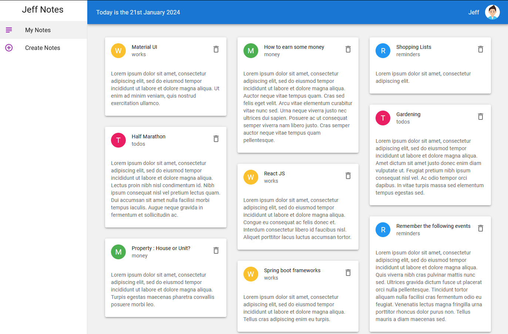
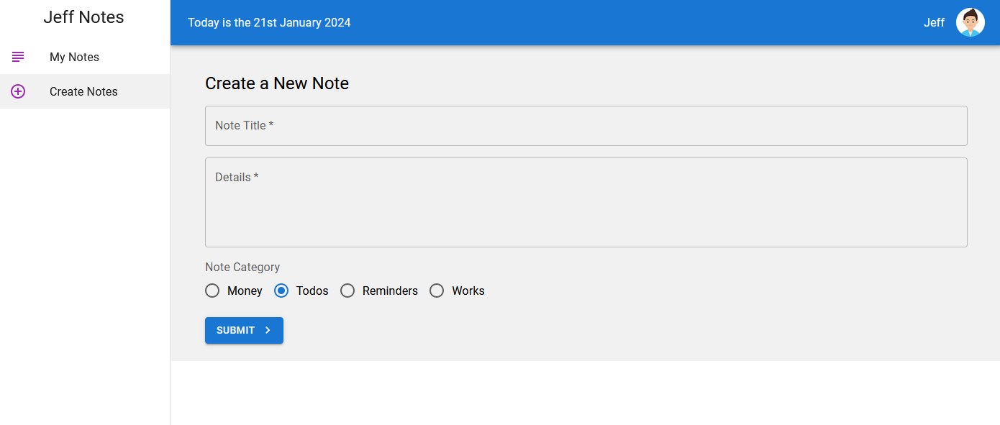

# Material UI for React

## Material UI

https://mui.com/

## Project Summary

### Objective

- To understand Material UI

### Applied tech

- React
- Material UI
- Json Server
- 3rd party JS library
  - date-fns : for Date format
  - react-masonry-css : for masonry layout

### UI outlook

Landing page : memo lists

  
Memo create page



## Project setup with React and React router dom

```
  npx install create-react-app .
  npm i react-router-dom
```

## Projects downloaded

Downloded project (node projects) need to get all the dependencies

```
  npm install
```

## Material UI Installation

### `Default Installation`

```
npm install @mui/material @emotion/react @emotion/styled
```

### `Roboto font`

- Material UI uses the Roboto font by default
- Easy to set up in public/index.html

```html
<link rel="preconnect" href="https://fonts.googleapis.com" />
<link rel="preconnect" href="https://fonts.gstatic.com" crossorigin />
<link
  rel="stylesheet"
  href="https://fonts.googleapis.com/css2?family=Roboto:wght@100;200;300;400;500;600;700&display=swap"
/>
<style>
  * {
    margin: 0;
    font-family: "Roboto", sans-serif;
  }
</style>
```

## Material UI : Part 1

### `prop : sx`

- To use only with Material UI components  
  Not working... (div is HTML element)
  ```
  <div sx={{color:"red"}}>abc</div>
  ```
  Working...
  ```
  <Box sx={{color:"red"}}>abc</div>
  ```
- html : div => Material UI : Box

### `To customize components (method 1)`

- use styled() method of @mui/material
- styled(targetComponent)({css});

```javascript
...

const StyledButton = styled(Button)({
  background: "skyblue",
  color: "#f1f1f1",
  margin: "5px",
  "&:hover": {
    background: "gray",
  },
});

const Note = () => {
  return (
    <Box>
      <Button variant="outlined" href="/create">
        Go to create page
      </Button>
      <StyledButton>Styled Button</StyledButton>
    </Box>
  );
};

export default Note;
```

### `To customize components (method 2)`

- To create an object containing css objects : const classes = ...
- In the rendering part(jsx), use sx prop to receive the objects : sx={classes.title}

```javascript
...

const classes = {
  title: {
    textDecoration: "underline",
  },
};
const Note = () => {
  return (
    <Box>
      <Typography
        sx={classes.title} //with sx props, you may write css
        variant="h1"
        color={"primary"}
        align="center"
      >
        Note
      </Typography>
    </Box>
  );
};
export default Note;
```

### `To customize Default Theme`

Material UI Default Theme info :  
https://mui.com/material-ui/customization/default-theme/

How to customize default theme

- Target file : App.js, or index.js
- To redefine css with createTheme() method
- To apply the them with ThemeProvider component

```javascript
...

const theme = createTheme({
  palette: {
    primary: {
      main: "#fefefe",
    },
    secondary: purple,
  },
});

function App() {
  return (
    // apply custom theme through prop : theme={theme}
    <ThemeProvider theme={theme}>
      <BrowserRouter>
        <Routes>
          <Route path="/" element={<Note />} />
          <Route path="/create" element={<Create />} />
        </Routes>
      </BrowserRouter>
    </ThemeProvider>
  );
}

export default App;
```

## `Form`

Basic form Including TextField and Radio

```javascript
...
// for css
const classes = {
  field: {
    margin: "16px 0",
    display: "block",
  },
};

const Create = () => {
  const [title, setTitle] = useState("");
  const [details, setDetails] = useState("");
  const [titleError, setTitleError] = useState(false);
  const [detailsError, setDetailsError] = useState(false);
  const [category, setCategory] = useState("todos");

  const handleSubmit = (e) => {
    e.preventDefault();

    setTitleError(false);
    setDetailsError(false);

    if (!title) setTitleError(true);
    if (!details) setDetailsError(true);

    if (title && details) {
      console.log(
        `Title : ${title}, Details: ${details}, Category: ${category}`
      );
      setTitle("");
      setDetails("");
      setCategory("todos");
    }
  };

  return (
    <Container>
      <Typography variant="h5" gutterBottom>
        Create a New Note
      </Typography>
      <form onSubmit={handleSubmit} noValidate autoComplete="off">
        <TextField
          onChange={(e) => setTitle(e.target.value)}
          value={title}
          sx={classes.field}
          id="title"
          label="Note Title"
          variant="outlined"
          required
          // focused
          fullWidth
          error={titleError}
        />
        <TextField
          onChange={(e) => setDetails(e.target.value)}
          value={details}
          sx={classes.field}
          id="details"
          label="Details"
          variant="outlined"
          multiline
          rows={4}
          fullWidth
          required
          error={detailsError}
        />
        <FormControl sx={classes.field}>
          <FormLabel>Note Category</FormLabel>
          <RadioGroup
            row
            value={category}
            onChange={(e) => setCategory(e.target.value)}
          >
            <FormControlLabel value="money" control={<Radio />} label="Money" />
            <FormControlLabel value="todos" control={<Radio />} label="Todos" />
            <FormControlLabel
              value="reminders"
              control={<Radio />}
              label="Reminders"
            />
            <FormControlLabel value="works" control={<Radio />} label="Works" />
          </RadioGroup>
        </FormControl>
        <Button
          type="submit"
          variant="contained"
          endIcon={<KeyboardArrowRightIcon />}
        >
          Submit
        </Button>
      </form>
    </Container>
  );
};

export default Create;
```

## JSON Server

### `JSON Server Installation`

- -g : gloval  
  If you have already installed globally, no need to install again!

```
npm install -g json-server
```

### `To create JSON data repository`

To create a folder, and a file to store json data

```javascript
// [/data/db.json]

{
  "notes": [
    {
      "title": "Material UI",
      "details": "detail .......",
      "category": "works",
      "id": "1"
    },
    {
      "title": "Yuna birthday present",
      "details": "detail ..",
      "category": "todos",
      "id": "2"
    },
    {
      "title": "How to earn some money",
      "details": "details....",
      "category": "money",
      "id": "3"
    }
  ]
}
```

### `JSON Server operation keywords`

To start json server directly from your terminal

```
json-server --watch data/db.json --port 8000
```

or in the package.json file, you can add scripts:

```
...
  "scripts": {
    "start": "react-scripts start",
    "db": "json-server --watch data/db.json --port 8000",
    "build": "react-scripts build",
    "test": "react-scripts test",
    "eject": "react-scripts eject"
  },
...
```

- npm init
  - To initialize a project and create the 'package.json' file

To run the script in the terminal

```
npm run db
```

### `To manage data through json server`

- Caution
  - onClick={myMethod()}  
    myMethod() will be automatically invoked.
  - onClick={() => myMethod()}  
    myMethod() will be invoked when on clicking

To do 'GET'

```javascript
...

const Note = () => {
  const [notes, setNotes] = useState([]);
  useEffect(() => {
    fetch(`http://localhost:8000/notes`)
      .then((response) => response.json())
      .then((data) => setNotes(data))
      .catch((error) => {
        console.log(`error : ${error}`);
      });
  }, []);
  return (
    <Container>
      {notes.map((note) => (
        <div key={note.id}>
          <div>{note.title}</div>
        </div>
      ))}
    </Container>
  );
};

export default Note;
```

To do 'POST'

```javascript
...

const Create = () => {
  const [title, setTitle] = useState("");
  const [details, setDetails] = useState("");
  const [category, setCategory] = useState("todos");
  const navigate = useNavigate();

  const handleSubmit = (e) => {

    e.preventDefault();

    if (title && details) {
      fetch(`http://localhost:8000/notes`, {
        method: "POST",
        headers: { "Content-type": "application/json" },
        body: JSON.stringify({ title, details, category }),
      }).then(() => {
        navigate("/");
      });
    }
  };

  return (
    <Container>
      ...
    </Container>
  );
};

export default Create;

```

To do 'DELETE'

```javascript
// [/src/pages/Note.js] -------------------------

...

const Note = () => {
  const [notes, setNotes] = useState([]);
  useEffect(() => {
    fetch(`http://localhost:8000/notes`)
      .then((response) => response.json())
      .then((data) => setNotes(data))
      .catch((error) => {
        console.log(`error : ${error}`);
      });
  }, []);

  const handleDelete = async (id) => {
    await fetch(`http://localhost:8000/notes/${id}`, { method: "DELETE" });
    let remainNotes = notes.filter((note) => note.id !== id);
    setNotes([...remainNotes]);
  };

  return (
    <Container>
      <Grid container spacing={3}>
        {notes.map((note) => (
          <Grid item key={note.id} xs={12} sm={6} md={3}>
            <NoteCard note={note} handleDelete={handleDelete} />
          </Grid>
        ))}
      </Grid>
    </Container>
  );
};

export default Note;

// [/src/components/NoteCard.js] ---------------------

...

const NoteCard = ({ note, handleDelete }) => {
  return (
    <div>
      <Card elevation={3}>
        <CardHeader
          action={
            <IconButton onClick={() => handleDelete(note.id)}>
              <DeleteOutlined />
            </IconButton>
          }
          title={note.title}
          subheader={note.category}
        />
        <CardContent>
          <Typography variant="body2" color={"textSecondary"}>
            {note.details}
          </Typography>
        </CardContent>
      </Card>
    </div>
  );
};

export default NoteCard;
```

## Material UI : Part 2

### `Grid`

- 12 divid systems

Basic concept

```javascript
// xs: extral small, sm: small, md: medium
<div>
  <Grid container>
    <Grid item xs={12} sm={6} md={3}>
      <Paper>1</Paper>
    </Grid>
    <Grid item xs={12} sm={6} md={3}>
      <Paper>2</Paper>
    </Grid>
    <Grid item xs={12} sm={6} md={3}>
      <Paper>3</Paper>
    </Grid>
    <Grid item xs={12} sm={6} md={3}>
      <Paper>4</Paper>
    </Grid>
  </Grid>
</div>
```

### `Layout`

Basic layout

1. To create Layout.js component
2. To wrap targets with the layout component

```javascript
// [/src/components/Layout.js]
// 1. To creaste layout.js
// To use prop : children

...

const classes = {
  mainContent: {
    background: "#f1f1f1",
    // 3*8 = "16px"
    padding: 3,
    window: "100%",
  },
};
const Layout = ({ children }) => {
  return (
    <Box>
      {/* app bar */}

      {/* side drawer */}

      <Box sx={classes.mainContent}>{children}</Box>
    </Box>
  );
};

export default Layout;

// [/src/App.js]
// 2. To wrap targets with the Layout component

...

const theme = createTheme({
  palette: {},
});

function App() {
  return (
    <ThemeProvider theme={theme}>
      <BrowserRouter>
        <Layout>
          <Routes>
            <Route path="/" element={<Note />} />
            <Route path="/create" element={<Create />} />
          </Routes>
        </Layout>
      </BrowserRouter>
    </ThemeProvider>
  );
}

export default App;

```

### `Drawer`

Permanent type drawer  
Basic concept

```javascript
...

const drawerWidth = 240;
const classes = {
  root: {
    // To display(in here separate) drawer and content as column
    display: "flex",
  },
  mainContent: {
    background: "#f1f1f1",
    padding: 3, // 3*8 = "16px"
    window: "100%",
  },
  drawer: {
    width: drawerWidth,
    flexShrink: 0,
    "& .MuiDrawer-paper": {
      width: drawerWidth,
      boxSizing: "border-box",
    },
  },
};
const Layout = ({ children }) => {
  return (
    <Box sx={classes.root}>
      {/* app bar */}

      {/* side drawer */}
      <Drawer sx={classes.drawer} variant="permanent" anchor="left">
        <Typography variant="h5">Jeff Notes</Typography>
      </Drawer>
      <Box sx={classes.mainContent}>{children}</Box>
    </Box>
  );
};
export default Layout;
```

### `List`

To create a list(in a drawer)  
Button type list with active color

```javascript
...

const drawerWidth = 240;
const classes = {
  root: {
    display: "flex",
  },
  mainContent: {
    background: "#f1f1f1",
    padding: 3, // 3*8 = "16px"
    width: "100%",
  },
  drawer: {
    width: drawerWidth,
    flexShrink: 0,
    "& .MuiDrawer-paper": {
      width: drawerWidth,
      boxSizing: "border-box",
    },
  },
  // active color for ListItemButton
  active: {
    background: "#f1f1f1",
  },
};
const Layout = ({ children }) => {
  const navigate = useNavigate();
  const location = useLocation();
  const menuItems = [
    {
      text: "My Notes",
      icon: <SubjectOutlined color="secondary" />,
      path: "/",
    },
    {
      text: "Create Notes",
      icon: <AddCircleOutlineOutlined color="secondary" />,
      path: "/create",
    },
    {
      text: "Others",
      icon: <SubjectOutlined color="secondary" />,
      path: "/others",
    },
  ];
  return (
    <Box sx={classes.root}>
      {/* app bar */}

      {/* side drawer */}
      <Drawer sx={classes.drawer} variant="permanent" anchor="left">
        <Box>
          <Typography variant="h5" sx={{ textAlign: "center", margin: "8px" }}>
            Jeff Notes
          </Typography>
        </Box>
        <Box>
          <List>
            {menuItems.map((item) => (
              <ListItemButton
                key={item.text}
                onClick={() => navigate(item.path)}
                sx={location.pathname === item.path ? classes.active : null}
              >
                <ListItemIcon>{item.icon}</ListItemIcon>
                <ListItemText primary={item.text} />
              </ListItemButton>
            ))}
          </List>
        </Box>
      </Drawer>
      {/* main content */}
      <Box sx={classes.mainContent}>{children}</Box>
    </Box>
  );
};
export default Layout;

```

## Useful JS library

### `date-fns`

toolset for manipulating JavaScript dates in a browser & Node.js.

1. install

```
npm i date-fns
```

2. Example

```javascript
import { format, formatDistance, formatRelative, subDays } from "date-fns";

format(new Date(), "'Today is a' eeee");
//=> "Today is a Saturday"

formatDistance(subDays(new Date(), 3), new Date(), { addSuffix: true });
//=> "3 days ago"

formatRelative(subDays(new Date(), 3), new Date());
//=> "last Friday at 7:26 p.m."
```

## Material UI : Part 3

### `Avatar with image`

To add image avatar on Appbar component

```javascript
...

const Layout = ({ children }) => {

  return (
    <Box sx={classes.root}>
      {/* app bar */}
      <AppBar sx={classes.appbar}>
        <Toolbar>
          <Typography flexGrow={1}>
            Today is the {format(new Date(), "do MMMM y")}
          </Typography>
          <Typography>Jeff</Typography>

          {/* '/' means public folder */}
          <Avatar
            alt="user"
            src="/user-png-64.png"
            sx={{ marginLeft: "16px" }}
          />
        </Toolbar>
      </AppBar>

      {/* main content */}
      <Box sx={classes.mainContent}>{children}</Box>
    </Box>
  );
};
export default Layout;
```

### `Avatar with circle and a character`

To add circle avatar with a character on Card component

```javascript
...

const NoteCard = ({ note, handleDelete }) => {

  // To give a few avatar per condition
  const avatarColor = {
    works: yellow[700],
    money: green[500],
    todos: pink[500],
  };

  return (
    <div>
      <Card elevation={3}>
      {/* string[0].toUpperCase()... first letter and upper case */}
        <CardHeader
          avatar={
            <Avatar
              sx={{ backgroundColor: avatarColor[note.category] || blue[500] }}
            >
              {note.category[0].toUpperCase()}
            </Avatar>
          }
        />
        <CardContent>
          <Typography variant="body2" color={"textSecondary"}>
            {note.details}
          </Typography>
        </CardContent>
      </Card>
    </div>
  );
};

export default NoteCard;

```

## Useful JS library : react-masonry-css

### `react-masonry-css`

CSS and native React rendering, for fast, responsive masonry layouts

1. install

```
npm i react-masonry-css
```

2. How to use

```javascript
// in react component ---------------------

const breakpointColumnsObj = {
  default: 4,
  1100: 3,
  700: 2,
  500: 1
};

return (
<Masonry
  breakpointCols={breakpointColumnsObj}
  className="my-masonry-grid"
  columnClassName="my-masonry-grid_column">
  {/* array of JSX items */}
</Masonry>
);

// in CSS -----------------------------------
.my-masonry-grid {
  display: -webkit-box; /* Not needed if autoprefixing */
  display: -ms-flexbox; /* Not needed if autoprefixing */
  display: flex;
  margin-left: -30px; /* gutter size offset */
  width: auto;
}
.my-masonry-grid_column {
  padding-left: 30px; /* gutter size */
  background-clip: padding-box;
}

/* Style your items */
.my-masonry-grid_column > div { /* change div to reference your elements you put in <Masonry> */
  /* background: grey; */
  margin-bottom: 30px;
}
```

2. Actual example

```javascript
...

const Note = () => {
...
  const breakpointColumnsObj = {
    default: 3,
    1100: 2,
    700: 1,
    // 500: 1
  };

  return (
    // <Container>
    //   <Grid container spacing={3}>
    //     {notes.map((note) => (
    //       <Grid item key={note.id} xs={12} sm={6} md={4}>
    //         <NoteCard note={note} handleDelete={handleDelete} />
    //       </Grid>
    //     ))}
    //   </Grid>
    // </Container>
    <Container>
      <Masonry
        breakpointCols={breakpointColumnsObj}
        className="my-masonry-grid"
        columnClassName="my-masonry-grid_column"
      >
        {notes.map((note) => (
          <div key={note.id}>
            <NoteCard note={note} handleDelete={handleDelete} />
          </div>
        ))}
      </Masonry>
    </Container>
  );
};

export default Note;

```

## Reference

Net Ninja : https://www.youtube.com/watch?v=0KEpWHtG10M&list=PL4cUxeGkcC9gjxLvV4VEkZ6H6H4yWuS58&index=1
